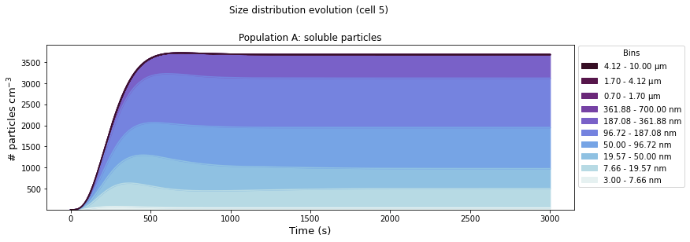

<h1 align = "center"> UFPy </h1>  

 

## Table of Contents

- [Introduction](#introduction)
- [Installation](#installation)
- [Usage](#usage)
- [Acknowledgments](#acknowledgments)
- [License](#license)

## Introduction

Master thesis project, in which we try to model ultrafine particle (UFP) concentrations using the [HAM](https://redmine.hammoz.ethz.ch/projects/hammoz) microphyics package, along with the [SALSA2.0](https://gmd.copernicus.org/articles/11/3833/2018/) module. 
Model data will be compared to measurement data. Measurements were made by [RIVM](https://www.rivm.nl/). Results of this may be used to improve performance of the LOTOS-EUROS model, used by the RIVM to forecast air quality.

## Installation

Start by running `pip install requirements.txt` after navigating to the `src/` folder. Next, make sure you place the HAM_box_OpenIFS model into the folders which contains the UFPy folder. Some manipulations need to be done to the model source files, depending on what you want to achieve. Instructions for this will follow (?).

## Usage

See the documentation files in `src/` for some example runs, as well as detailed descriptions of the functions in the py-files.

## Acknowledgments

Supervised by [Prof. Guus Velders](https://www.uu.nl/medewerkers/GJMVelders).

## License

[MIT](https://choosealicense.com/licenses/mit/) license, Copyright (c) 2024 Rens van Eck.