<h1 align = "center"> UFPy </h1> <br>

This file will serve as a complete and thorough documentation of the (main) functions contained in this project, their arguments and how they work together. Examples of how to use most of these will be found in `Reproduce_thesis.py`, located in the `src/` folder. Additional notes are given for each function as needed; the description in the docstring (also seen in each source file) should come a long way. Example images are put in spoiler tags for the more "relevant" plotting functions, to get a taste for the output they produce.

1. [Running the model](#Runming_the_model)
2. [Model metadata](#model-metadata)
3. [Model data](#model-data)
4. [Utils](#utils)
5. [Plotting](#plotting)

---

## Running the model
This commands runs the model. Make sure that the HAM_box_OpenIFS model is also contained within your GitHub folder (needed for relative pathing).

### run_model

```python
def run_model(experiment_name, recompile = True, verbose = True):
    """
    Runs the HAM_box_OpenIFS model. Make sure it is contained within the folder containing the UFPy folder.

    Parameters
    ----------
    experiment_name : STR
        Name of the folder to which the data should be written (in results/).
    recompile : BOOL, optional
        Recompile the model before running. The default is True.
    verbose : BOOL, optional
        Output error messages encountered in terminal. The default is True.

    Returns
    -------
    None.

    """
```
Model is run (and recompiled first if set to `True`) by sending a command through the WSL terminal. Output  data is copied and saved to a folder named `experiment_name` in the `results/` folder (see [copy_model_data](#copy_model_data)).

### run_variation

This commands runs a series of simulations, one after the other. Results are stored in a folder, with subfolders containg model results. Subfolders are named after the order the corresponding simulations are performed in.
```python
def run_variation(variation_name, nested_environmental_values, particle_flux, dispersion_rate):
    """
    Execute multiple model runs, with varied environental values

    Parameters
    ----------
    variation_name : STRINMG
        Name of the "overarching" experiment.
    nested_environmental_values : List of list
        (Nested) list / matrix of environmental values.
    particle_flux : LIST
        (Nested) list / matrix of particle fluxes.
    dispersion_rate : FLOAT
        (Nested) Dispersion rate per timestep.

    Returns
    -------
    None.

    """
```
Used for running ensembles of simulations. If you wish to run an environmental variation, be sure to supply it with a nested list, in which each element is a list with the order [temperature, humidity, air pressure], while leaving the particle flux and dispersion rate as a nested list and list resp. with only one sub-element, so e.g. `particle_flux = [[0, 1, 2, 3, ...]]` and `dispersion_rate = [0.01]`. If you wish to run a dispersion/input variation, be sure to only supply ONE set of [temperature, humidity, air pressure], while the particle flux and dispersion rate may be varied however one wishes. The function then runs every possible combination of the elements provided.

---

## Model metadata

### read_model_metadata

```python
def read_model_metadata():
    """
    Reads CURRENT metadata from all files found in the params.json file

    Parameters
    ----------
    file_list : LIST
        List of names of files (without .f90) to be read from.
    paramdict_list : LIST
        List of dictionaries containing parameter info to be read (see copy_model_metadata() for more info).

    Returns
    -------
    metadata : STRING
        Formatted string of model metadata.

    """
```
No arguments. Uses [gen_params](#gen_params) to read the Fortran source files for the parameters set in `params.json`, and extracts their values (through regex). These are all written into a string, with each line containing one parameter and its value. Then, [read_enviromental_data](#read_environmental_data) is called, and added to the string of metadata. Primarily built to be used in [copy_model_metadata](#copy_model_metadata).

### copy_model_metadata

```python
def copy_model_metadata(destination_folder):
    """
    Copies the model metadata to metadata.txt.

    Parameters
    ----------
    destination_folder : STR
        Name of the folder to which metadata.txt should be written.

    Returns
    -------
    None.

    """
```
Set a value to `desination_folder` to copy the model metadata of that run to a folder in `results` of that name. This function calls [read_model_metadata](#read_model_metadata), and writes it into the `metadata.txt` file, to keep track of the settings of each model run individually.

### gen_params

```python
def gen_params():
    """
    This function reads the params.json file, to see which parameters need to be kept track of

    Returns
    -------
    paramlist : LIST
        List of dictionaries containing regex patterns for each parameter.
    files : LIST
        List of files containing the parameter info.

    """
```
No arguments. Reads the params.json file, which is used to document which parameters of the model need to be kept track of. Each of these requires:
- A name, which should be identical to how it is found in the `.f90` source files of the model,
- An indication whether they are numerical (`num`) or boolean (`bool`),
- The name of the file in which the parameter is found (without .`f90`).

### read_environmental_data

```python
def read_environmental_data():
    """
    Reads the environmental.dat file, to see which values have been used to run the model last.
    
    Returns
    -------
    metadata : STRING
        Formatted string of model environmental data.

    """
```
No arguments. Reads the `environmental.dat` file, which contains, in order, the values to be fed into the models input for ambient temperature, specific humidity and ambient pressure (resp. pt, pqm1, pap). 

### write_environmental_data

```python
def write_environmental_data(environmental_vals):
    """
    Writes values to the environmental.dat file **IN ORDER**
    [pt, pqm1, pap]
    
    Parameters
    ----------
    environmental_vals : LIST
        Contains the values of the environmental values **IN ORDER**.

    Returns
    -------
    None.

    """
```
Arugment `environmental_vals` should be given as `list`, containing the values of the model environmental variables in the following order:
\[Ambient temperature, specific humidity, ambient pressure\], or in the terms used in the `.f90` source files: \[pt, pqm1, pap\].
These are written to the `environmental.dat` file in the `input` folder of the HAM_box_OpenIFS folder, to be read by the model. Instructions on how to edit the model source files may follow. This function is primarily built to modify environmental values without having to recompile the model, saving time.

### write_particle_input_data

```python
def write_particle_input_data(particle_flux = [4e6, 6e6, 3.6e6, 1.8e5, 3.8e4, 4e3, 0, 0, 0], dispersion_rate = 0.01):
    """
    Writes values to the particle_input.dat file **IN ORDER**
    [input per bin (sep by space) per second]
    [dispersion_rate]

    Parameters
    ----------
    particle_flux : LIST, optional
        Contains particle flux per bin. The default is [4e6, 6e6, 3.6e6, 1.8e5, 3.8e4, 4e3].
    dispersion_rate : FLOAT, optional
        Dispersion rate per timestep. The default is 0.01.

    Returns
    -------
    None.

    """
```
The `input.dat` file is edited to contain the particle_flux input, and dispersion rate set by this function. This allows the user to manage input without changing the source code of the model, and foregoes the need to recompile. 

### read_particle_input_data

```python
def read_particle_input_data():
    """
    Reads the particle_input.dat file, to see which values have been used to run the model last.

    Returns
    -------
    metadata : STRING
        Formatted string of model environmental data.

    """
```
No arguments, see description. Formatted string is ready to be read by any of the other implemented functions, such as [read_model_data](#read_model_data).


### check_metadata

```python
def check_metadata():
    """
    Loops through all model result folders and reads their metadata.
    
    Returns
    -------
    metadict : DICT
        Dictionary, with keys the name of every result folder, and values being the parameters of each model run folder.

    """
```
No arguments. Collects all the metadata available from each model run so far, and outputs them into a dictionary. Can be used to reduce running time dynamically, by checking whether a run has already been performed, and skipping a certain set of settings if so. Not yet in use.

---

## Model data

### copy_model_data

```python
def copy_model_data(destination_folder):
    """
    Copies model output to the destination folder.

    Parameters
    ----------
    destination_folder : STR
        Name of the folder to which num.dat should be copied.

    Returns
    -------
    None.

    """
```
Set a value to `desination_folder` to copy the model output of that run to a folder in `results` of that name. This function also calls [copy_model_metadata](#copy_model_metadata), and writes this data into the same folder.

### read_model_data

```python
def read_model_data(destination_folder):
    """
    Reads the num.dat and metadata files within the destination_folder.

    Parameters
    ----------
    destination_folder : STR
        Name of the folder in results/ to be read from.
    gridcell : INT
        Index of gridcells whose data to read. Default is 1.

    Returns
    -------
    num : DataFrame / dictionary of DataFrames
        Pandas DataFrame of the num.dat file. Dictionary of DataFrames when given a directory containing subdirectories.

    metadata : string / dictionary of strings
        String of model metadata. Dictionary of strings when given a directory containing subdirectories.
    """
```
Primary way of reading back the output of model runs. Avoids having to rerun the model over and over again, at the expense of some storage space. 
Also capable of reading the results of variation runs, in which case the output is in the form of dictionaries of DataFrames and strings (usually named `numdict` and `metadict`), whose keys are the index of each component simulation run. 

---

## Utils

These functions are usable in various other situations, hence their position in `utils.py`.

### parse_metadata
```python
def parse_metadata(metadata):
    """
    Parse metadata string to dictionary for easier variable reading

    Parameters
    ----------
    metadata : STR
        String of metadata as outputted by read_model_metadata.

    Returns
    -------
    parsed : DICT
        Dictionary of metadata.

    """
```
This is a particularly handy function, which turns the metadata string used by all functions into a dictionary which is more easily legible and usable for other purposes.

### order_of_magnitude
```python
def order_of_magnitude(number):
    """Calculates order of magnitude of number"""
```

### q2RH
```python
def q2RH(q, p, T):
    """Calculates relative humidity from specific humidity"""
```

### RH2q
```python
def RH2q(RH, p, T):
    """Calculates specific humidity from relative humidity"""
```

### complementary_color
```python
def complementary_color(r, g, b):
   """returns RGB components of complementary color"""
```

### print_underlined
```python
def print_underlined(text):
    """print the input argument with a line under it"""
```

### lognormal
```python
def lognormal(x, sigma, center_x, scale = 1):
    """Returns **normalized** lognormal curve"""
```
Setting the scale to anything other than 1 is a cheeky way of making it not normalised.

## Plotting

The functions [plot_size_dist](#plot_size_dist), [define_bin_boundaries](#define_bin_boundaries) and [plot_size_dist_evolution](#plot_size_dist_evolution) were supplied graciously by [Harri Kokkola](#https://en.ilmatieteenlaitos.fi/cv-harri-kokkola). They have been edited minutely to allow for dynamic saving. The other functions were added afterwards by me. 

### define_bin_boundaries

```python
def define_bin_boundaries(populations = ['1a', '2a', '2b']):
    """
    Defines bin boundaries for the various particle populations.

    Parameters
    ----------
    populations : List, optional
        List of particle populations. The default is ['1a', '2a', '2b'].

    Returns
    -------
    dict
        Bin boundaries per population.

    """
```

### plot_size_dist

```python
def plot_size_dist(
    rdry, num, rows=[0], populations=['a', 'b'],
    xmin=None, xmax=None,
    ymin=None, ymax=None,
    fig=None, axes=None,
    exp_name="", title="", name_addition="",
    **kwargs
):
    """
    Plots size distributions at various timesteps.

    Parameters
    ----------
    rdry : DataFrame
        Contains the bin boundaries.
    num : DataFrame
        Contains the numbers of particles per bin.
    rows : List, optional
        Time steps to be read and plotted. The default is [0].
    populations : List, optional
        Which populations of particles to show. The default is ['a', 'b'].
    xmin : Float, optional
        Left x-axis limit. The default is None.
    xmax : Float, optional
        Right x-axis limit. The default is None.
    ymin : Float, optional
        Bottom y-axis limit. The default is None.
    ymax : Float, optional
        Top y-axis limit. The default is None.
    exp_name : String, optional
        Name of the experiment. The default is "". Leave empty to forego saving the image.
    title : String, optional
        Title of the image. The default is "".
    name_addition: String. The default is ""
        Suffix for filename.
    Returns
    -------
    None.

    """
```
<details>
    <summary>Click to reveal example image.</summary>
    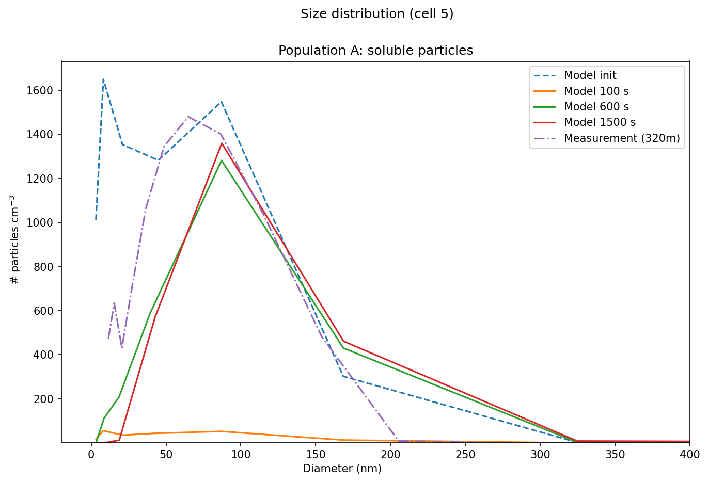
</details>

### plot_size_dist_evolution

```python
def plot_size_dist_evolution(
    rdry, num, populations = ['a', 'b'],
    xmin = None, xmax = None,
    ymin = None, ymax = None,
    vmin = None, vmax = None,
    exp_name = "", title = "",):
    """
    

    Parameters
    ----------
    rdry : DataFrame
        Contains the bin boundaries.
    num : DataFrame
        Contains the numbers of particles per bin.
    rows : List, optional
        Time steps to be read and plotted. The default is [0].
    populations : List, optional
        Which populations of particles to show. The default is ['a', 'b'].
    xmin : Float, optional
        Left x-axis limit. The default is None.
    xmax : Float, optional
        Right x-axis limit. The default is None.
    ymin : Float, optional
        Bottom y-axis limit. The default is None.
    ymax : Float, optional
        Top y-axis likmit. The default is None.
    vmin : Float, optional
        Bottom limit of the colorbar. The default is None.
    vmax : FLoat, optional
        Top limit of the colorbar. The default is None.
    exp_name : String, optional
        Name of the experiment. The default is "". Leave empty to forego saving the image.
    title : String, optional
        Title of the image. The default is "".

    Returns
    -------
    None.

    """
```

<details>
    <summary>Click to reveal example image.</summary>
    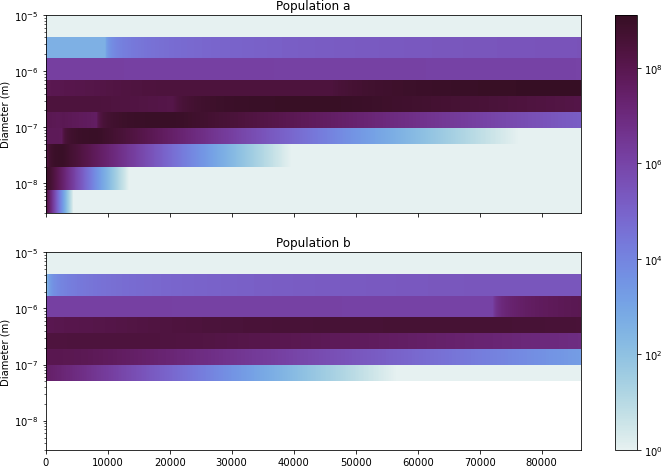
</details>

### stacked_timeseries_plot

```python
def stacked_timeseries_plot(
        num, populations = ['a', 'b'],
        xmin = None, xmax = None,
        ymin = None, ymax = None,
        exp_name = "", title = "", name_addition = "",
        colormap = None,
        highlights = None, highlight_colors = None):
    """
    Generates vertically stacked timeseries, each layer being a bin of the model.

    Parameters
    ----------
    num : DataFrame
        Contains the numbers of particles per bin.
    populations : List, optional
        Which populations of particles to show. The default is ['a', 'b'].
    xmin : Float, optional
        Left x-axis limit. The default is None.
    xmax : Float, optional
        Right x-axis limit. The default is None.
    ymin : Float, optional
        Bottom y-axis limit. The default is None.
    ymax : Float, optional
        Top y-axis limit. The default is None.
    exp_name : String, optional
        Name of the experiment. The default is "". Leave empty to forego saving the image.
    title : String, optional
        Title of the image. The default is "".
    name_addition: String. 
        Suffix for filename. The default is "".
    colormap : Colormap, optional
        Colormap of the data to be shown. The default is None.
    highlights : List, optional
        List of times to highlight by vertical lines. The default is None.
    highlight_colors : List, optional
        List of colors to highlight the times by. The default is None.

    Returns
    -------
    fig : TYPE
        Matplotlib figure object.
    axes : TYPE
        Matplotlib axes object.

    """
```
This is the main timeseries plotting function we ended up using, as it neatly shows when stable backgrounds show up.
<details>
    <summary>Click to reveal example image.</summary>
    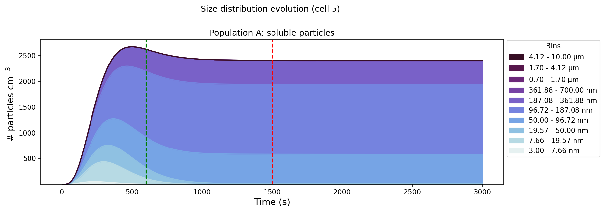
</details>


### plot_variation_scatter

```python
def plot_variation_scatter(numdict, metadict, exp_name = "", binName = "1a1", time = 0, name_addition = ""):
    """
    Generates sensitivity scatters of a environmental variable variation series.

    Parameters
    ----------
    numdict : Dictionary
        Dictionary of Pandas Dataframes (like num in other functions).
    metadict : Dictionary
        Dictinary of metadata strings.
    exp_name : String, optional
        Name of the experiment. Leave empty to forego saving the image. The default is "".
    binName : String, optional
        Name of the bin to be plotted. The default is "1a1".
    time : Integer, optional
        Time to be plotted. The default is 0.
    name_addition : String, optional
        File name addition, for easy lookup. The default is "".

    Returns
    -------
    None.

    """
```
Generally unused. Works together with how [read_model_data](#read_model_data) reads data from variation ensembles; the `numdict` and `metadict` resulting from that function can be used directly as arguments for this one.

### plot_variation_surface

```python
def plot_variation_surface(numdict, metadict, exp_name = "", binName = "1a1", time = 0, elev = 20, azi = 110, name_addition = "",
                           fig = None, ax = None, colormap = None):
    """
    Generates sensitivity surfaces of environmental variable variation runs.

    Parameters
    ----------
    numdict : Dictionary
        Dictionary of Pandas Dataframes (like num in other functions).
    metadict : Dictionary
        Dictinary of metadata strings.
    exp_name : String, optional
        Name of the experiment. Leave empty to forego saving the image. The default is "".
    binName : String, optional
        Name of the bin to be plotted. Entering multitple sums the bins together. The default is "1a1".
    time : Integer, optional
        Time to be plotted. The default is 0.
    elev : Float, optional
        Elevation of the perspective. The default is 20.
    azi : Float, optional
        Azimuth of the perspective. The default is 110.
    name_addition : String, optional
        File name addition, for easy lookup. The default is "".
    fig : Matplotlib Figure, optional
        Figure to add multiple surfaces in one. The default is None.
    ax : Matplotlib Axes, optional
        Axis to add multiple surfaces in one. The default is None.
    colormap : Matplotlib Colormap, optional
        Colormap to color surfaces. The default is None.

    Returns
    -------
    fig : Matplotlib Figure, optional
        Figure to add multiple surfaces in one.
    ax : Matplotlib Axes, optional
        Axis to add multiple surfaces in one.

    """
```
The preferred variation plotting function. This interpolates data and shows it as a nice 2D surface. It automatically determines what kind of variation was performed, and places the values on the axes accordingly. Do take note that, given the dimensionality of the graph, it can only deal with 2 varied (environmental) variables at a time. Works together with how [read_model_data](#read_model_data) reads data from variation ensembles; the `numdict` and `metadict` resulting from that function can be used directly as arguments for this one. Variation of dispersion and flux input is currently not implemented due to there being too many possibilities. See [plot_dispersion_variation](#plot_dispersion_variation), [plot_flux_peak_variation](#plot_flux_peak_variation), and [plot_flux_scale_variation](#plot_flux_scale_variation) for options. 
<details>
    <summary>Click to reveal example image.</summary>
    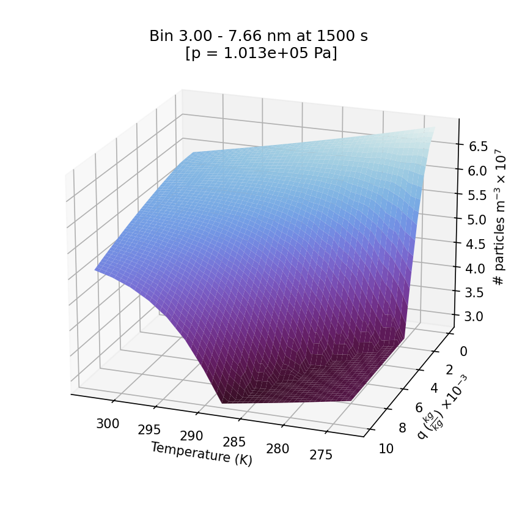
</details>

### plot_dispersion_variation

```python 
def plot_dispersion_variation(numdict, metadict, rdry, exp_name = "", binName = "2a1", time = 1500, name_addition = ""):
    """
    Use this function to plot variation series where ONLY dispersion was changed

    Parameters
    ----------
    numdict : Dictionary
        Dictionary of Pandas Dataframes (like num in other functions).
    metadict : Dictionary
        Dictinary of metadata strings.
    rdry: DataFrame
        DataFrame containing bin boundaries per time step.
    exp_name : String, optional
        Name of the experiment. Leave empty to forego saving the image. The default is "".
    binName : String, optional.
        Name of bin to plot in dispersion relation thing. Default is "2a1".
    time : Integer, optional
        Time to be plotted. The default is 1500.
    name_addition : String, optional
        File name addition, for easy lookup. The default is "".

    Returns
    -------
    None.

    """
```
Works together with how [read_model_data](#read_model_data) reads data from variation ensembles; the `numdict` and `metadict` resulting from that function can be used directly as arguments for this one. Make sure that ONLY dispersion was varied; example functions will be available for this. All other variables should be kept constant. Not becauwe it'll break the function, but precisely because this function will plot it as if nothing else was varied, potentially skewing results. 
<details>
    <summary>Click to reveal example image.</summary>
    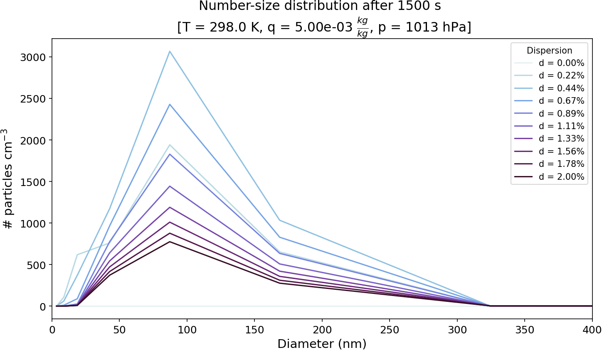
    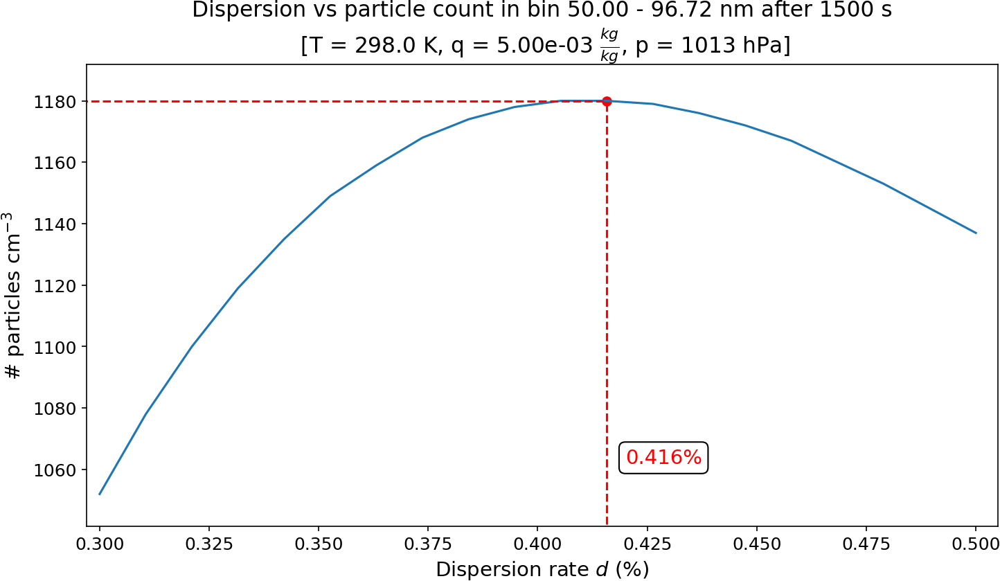
</details>

### plot_flux_peak_variation

```python
def plot_flux_peak_variation(numdict, metadict, exp_name = "", binName = "", time = 1500, name_addition = ""):
    """
    Use this function to plot variation series where ONLY the peak of the particle influx was shifted

    Parameters
    ----------
    numdict : Dictionary
        Dictionary of Pandas Dataframes (like num in other functions).
    metadict : Dictionary
        Dictinary of metadata strings.
    exp_name : String, optional
        Name of the experiment. Leave empty to forego saving the image. The default is "".
    time : Integer, optional
        Time to be plotted. The default is 1500.
    binName : String, optional
        Name of the bin to be plotted. Entering multitple sums the bins together. The default is "1a1".
    name_addition : String, optional
        File name addition, for easy lookup. The default is "".

    Returns
    -------
    None.

    """
```
Works together with how [read_model_data](#read_model_data) reads data from variation ensembles; the `numdict` and `metadict` resulting from that function can be used directly as arguments for this one. Make sure that ONLY the peak of the (lognormal) input flux was varied; example functions will be available for this. All other variables should be kept constant. Not becauwe it'll break the function, but precisely because this function will plot it as if nothing else was varied, potentially skewing results. Not used in the thesis.
<details>
    <summary>Click to reveal example image.</summary>
    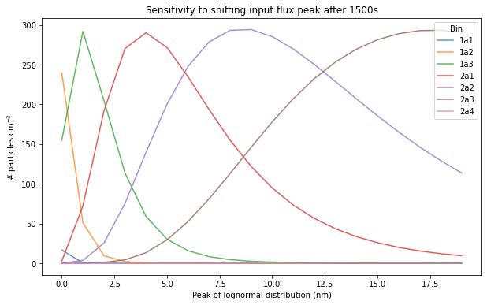
</details>


### plot_flux_scale_variation

```python
def plot_flux_scale_variation(numdict, metadict, exp_name = "", binName = "", time = 1500, name_addition = ""):
    """
    Use this function to plot variation series where ONLY the scale of the particle influx was shifted

    Parameters
    ----------
    numdict : Dictionary
        Dictionary of Pandas Dataframes (like num in other functions).
    metadict : Dictionary
        Dictinary of metadata strings.
    exp_name : String, optional
        Name of the experiment. Leave empty to forego saving the image. The default is "".
    time : Integer, optional
        Time to be plotted. The default is 1500.
    binName : String, optional
        Name of the bin to be plotted. Entering multitple sums the bins together. The default is "1a1".
    name_addition : String, optional
        File name addition, for easy lookup. The default is "".

    Returns
    -------
    None.

    """
```
Works together with how [read_model_data](#read_model_data) reads data from variation ensembles; the `numdict` and `metadict` resulting from that function can be used directly as arguments for this one. Make sure that ONLY the scale of the (lognormal) input flux was varied; example functions will be available for this. All other variables should be kept constant. Not becauwe it'll break the function, but precisely because this function will plot it as if nothing else was varied, potentially skewing results. Scale will be calculated internally by the function, and has only been tested on lognormal distributions. 
<details>
    <summary>Click to reveal example image.</summary>
    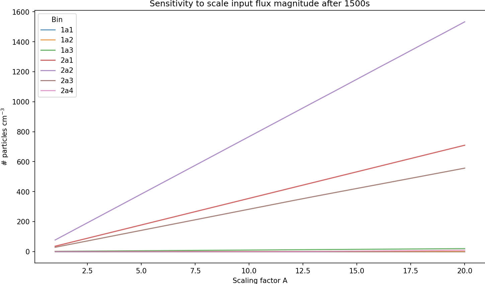
</details>

### show_model_lognormal_flux
```python
def show_model_lognormal_flux(sigma = 1.68, center_x = 90, scale = 1, label = "", file_addition = ""):
    """
    Generates a plot of the lognormal distribution, with correpsonding bars for what it looks like translated
    into SALSA2.0 bins. 

    Parameters
    ----------
    sigma : Float, optional
        Geometric standard deviation of the lognormal distribution. The default is 1.68.
    center_x : Float, optional
        X-coord of the peak of the distribution. The default is 90.
    scale : Float, optional
        Factor to multiply the whole distribution with. The default is 1.
    label : String, optional
        Label for the plot, shown in legend. The default is "".
    file_addition : String, optional
        Label for the file, for better tracking in file system. The default is "".

    Returns
    -------
    None.

    """
```
Corrected for air density. "Realistic" counterpart to [show_normalized_lognormal_flux](#show_normalised_lognormal_flux).
<details>
    <summary>Click to reveal example image.</summary>
    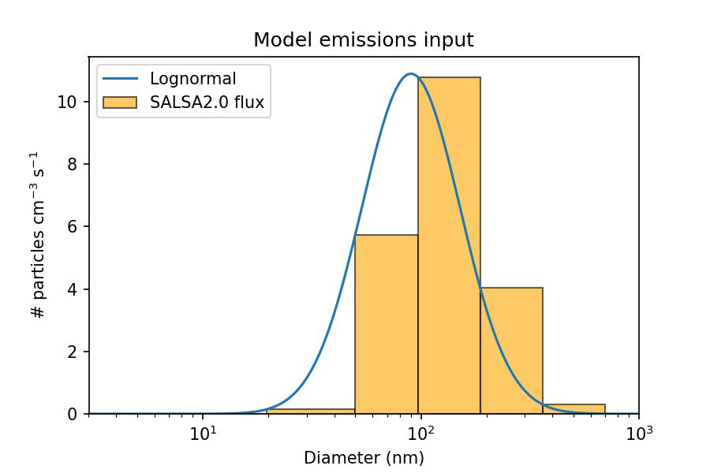
</details>

### show_normalised_lognormal_flux
```python
def show_normalised_lognormal_flux(sigma = 1.68, center_x = 90, scale = 1, title = "", label = "", file_addition = ""):        
    """
    Generates the normalized version of the lognormal distribution as reported by Harris and Maricq, 2001.
    With correpsonding bars for what it looks like translated into SALSA2.0 bins. 

    Parameters
    ----------
    sigma : Float, optional
        Geometric standard deviation of the lognormal distribution. The default is 1.68.
    center_x : Float, optional
        X-coord of the peak of the distribution. The default is 90.
    scale : Float, optional
        Factor to multiply the whole distribution with. The default is 1.
    title : String, optional
        Title of the figure. The default is "". 
    label : String, optional
        Label for the plot, shown in legend. The default is "".
    file_addition : String, optional
        Label for the file, for better tracking in file system. The default is "".

    Returns
    -------
    None.

    """
```
<details>
    <summary>Click to reveal example image.</summary>
    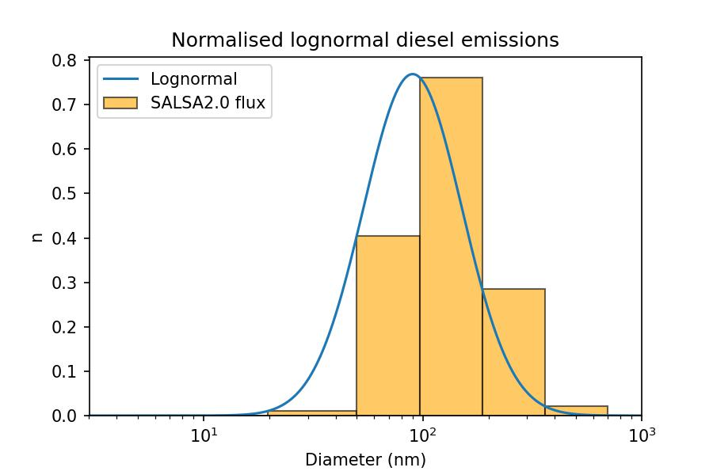
</details>

### show_model_flux
```python
def show_model_flux(particle_flux, file_addition = ""):
    """
    Shows any model flux given as argument, shown as bars. 

    Parameters
    ----------
    particle_flux : List
        List of particle fluxes.
    file_addition : String, optional
        Label for the file, for better tracking in file system. The default is "".

    Returns
    -------
    None.

    """
```
This will plot any distribution you give it as a bar plot, onto the right (default) bin boundaries used by SALSA2.0; no need for anything to do with lognormal distributions.
<details>
    <summary>Click to reveal example image.</summary>
    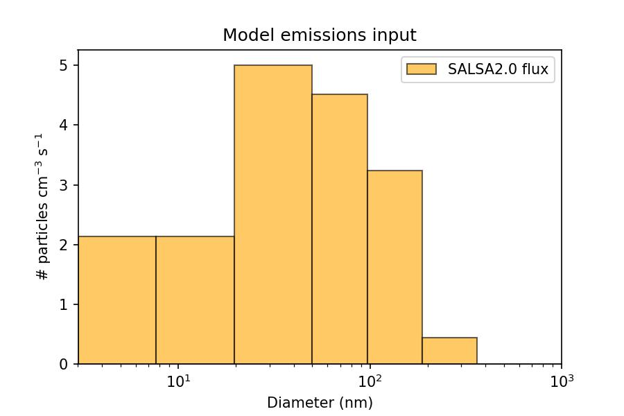
</details>
